56是目标个数？60是未来预测的timestamps？

经过多轮调试，56这个数值是变化的，可能更接近agent数量。

6可能是6个proposal。

reg_mask是一组bool mask.

需要知道这个regmask是如何生成的。

尝试画了一下预测的proposal trajectorie，但是貌似有两个问题，一个是太多了，一个是好像原点都是00

先解决太多proposal的问题，l2norm后选取best proposals，好了一些，但现在基本确认原点是0,0，这符合论文中相对时空坐标系的描述。

这另一方面说明gt也经过了同样的后处理。通过逆向去写或许能还原回到世界坐标。试试看。

----

在看代码的时候发现test中只使用了traj_refine，但是eval中均使用了traj_proposal和traj_refine，不清楚是何用意。

另外，代码中pi到底是什么感觉不知所云，但是在val的代码中找到了一部分描述：

----

唉又看到有现成的轮子，开摆（大雾）

但是代码还有一些工程问题需要解决。现在就是只有一帧的pred可以拿到。

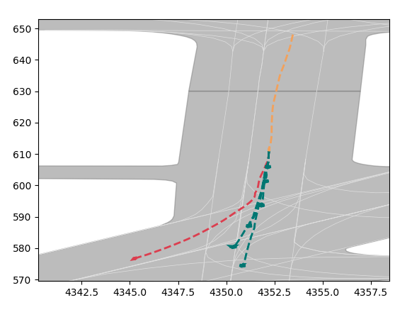 这个效果还可以

https://blog.csdn.net/qq_45383577/article/details/134974315

但是看上去只有一次轨迹可视化，并不是实时交互的。我希望的效果是每一帧都有轨迹预测结果，并且随视频演进，预测会随之变化。

此外这个可视化还有一个问题，就是其他agent的轨迹并没有可视化出来，如果后续用vlm的话不太好分析，所以想办法看能不能把其他agent的未来预测也画出来。

要做到实时的预测可视化，就需要确认pred是否在每一个时刻都有pred输出。

要知道图中是如何做到的，就要知道可视化代码是如何选取预测时刻。

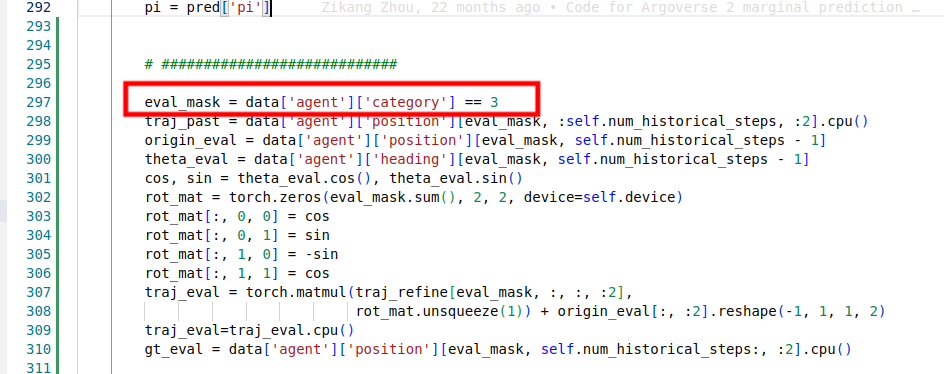

这里的category不是很明朗。

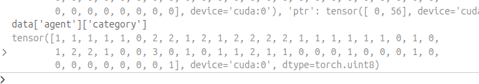

对应上这里，只有一个3说明应该是自车ego vehicle，0,1,2分别是其他的类别，估计得查找一下手册。或者直接改这里试试看会发生什么:

category=2:
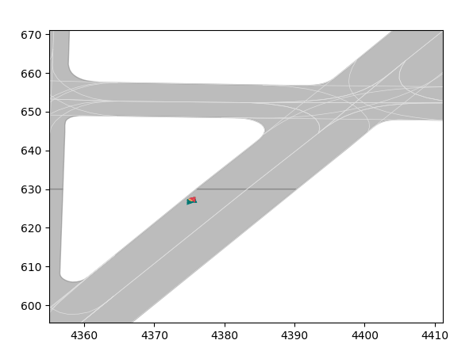

category=0:
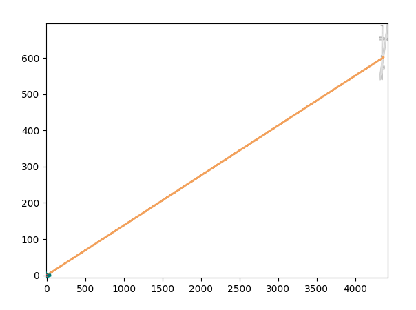

category=1:
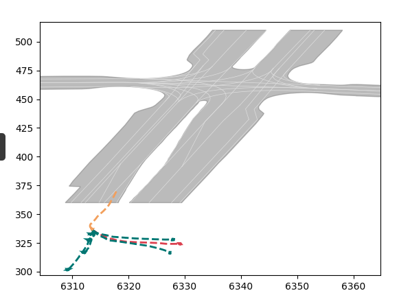

总之都挺抽象的（category=1还有点有趣，应该是car的轨迹），不过history_timestamp好像是给我找到了。在dataset中，默认写了50，按照10hz来看，可能正好能够对应上5s的视频开始有预测轨迹。（注意这里50就是指帧，至于是不是5s还涉及到视频的帧率，所以是一个主观值。）

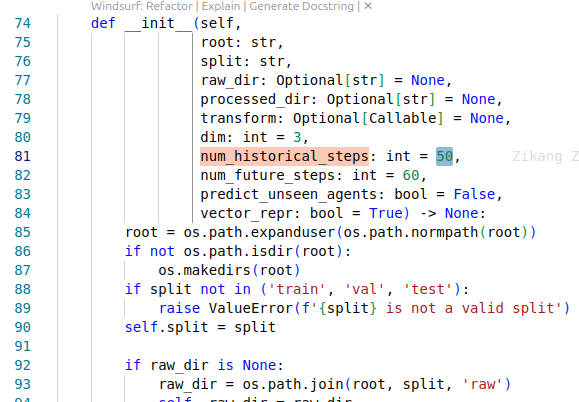

如果遍历这个history，应该就能实现上述的功能了。

但有个问题，如果强行改的话，这个参数会不会和模型耦合？有这个可能么？

这个是两个问题。

模型耦合的是模型需要给出未来预测所必须要的观测帧数历史帧，这个是个超参。但有可能这里的只是为了构建真值选的一个采样，正好50？

先改几个数值看一看：

history=20:
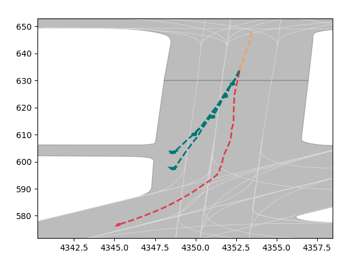

history=40:
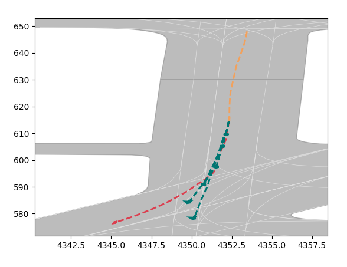

history=60:
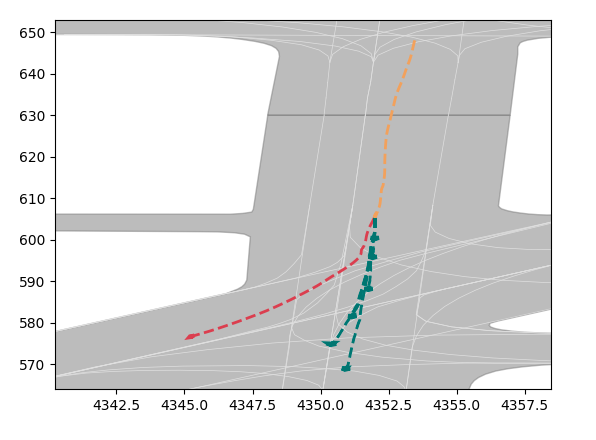

history=80:

history=100:
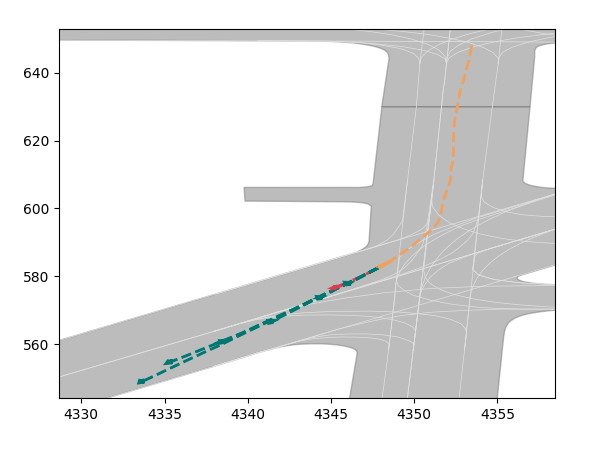

挺好说明还是问题不大，遍历就可以有视频了。封装成函数更方便？

----

在写函数的过程中发现一个问题较为严重，看上面几个时刻也看出来了。实际上，模型预测的轨迹并没有变化，只是根据不同时刻的位置和朝向在旋转平移。

为什么呢？因为模型没有在那个时刻进行重新推理！这就很尴尬了。

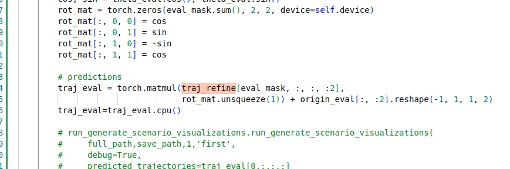

这里category也只是为了选取目标用的。

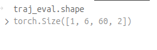

这里可以看到traj_eval：一个目标，6条候选轨迹，每条轨迹包括60个预测的未来，以及xy两个维度的坐标。

为此，应该需要修改pred = self(data)的内部输出，让pred包含所有时刻的推理结果（而不只是t=50)。

先看能否改数据集？可能这个参数是数据集写死导致的。

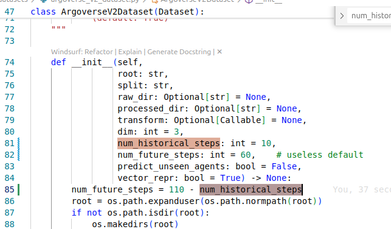

目前看修改这里好像没什么用。有可能是修改没有传递到这里。

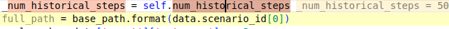

debug的结果确实如此。

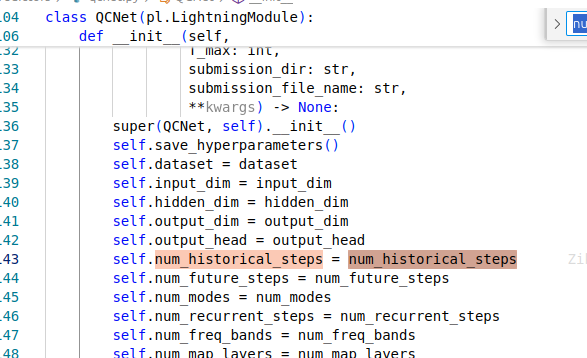

需要找到qcnet的初始化位置以及入参传递。经过对这个qcnet的类__init__()函数进行反复的断点调试（过程还挺煎熬的），找到直接改这个变量值就可以影响下游的所有动作，history=10的时候也符合预期了：

history=10:
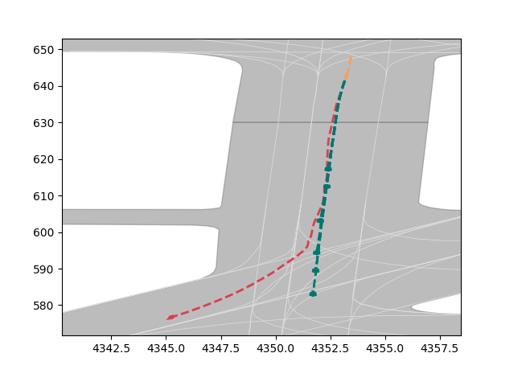

有几个发现：

1. historical_steps这个变量不知道在哪里给传进去的，而且是写死的，还没找到。外围怎么改都对内部不生效。
2. 只修改qcnet的这个变量没用，encoder和decoder的也要改，这说明可能数据是通过索引的方式来去取的，而不是值传递。（也就是说数据已经按照database的方式组织起来了）

另一个问题是如果t>50怎么办，因为未来有60所以可能会超过sequence边界。

但是设置t=80好像也没出什么岔子：
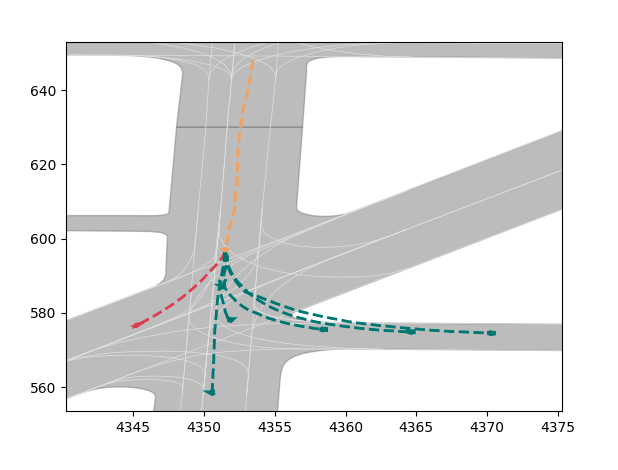

如果设置成t=100呢？
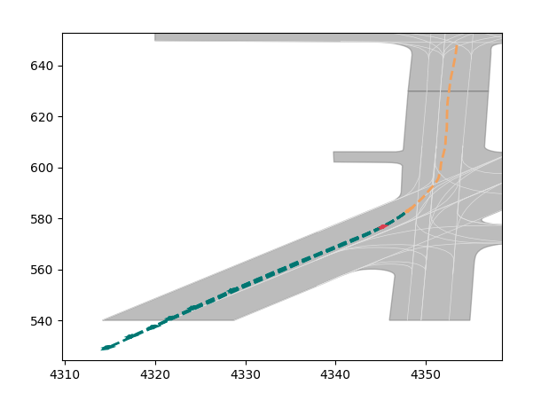

甚至这样都没问题。那改成t=0呢？ 0好像挂了。那就把可视化限定在10-100帧吧就这么定了。

还有另外一个问题，就是地图边界。如果超过了地图边界就要截断。我目前想到的方式是，取轨迹的一个上界，例如，x上或者y上，变化幅度最大的，并且以此上下拓宽两倍，切割一个正方形出来。

这么一想觉得视频好像很麻烦。因为其实也就是想看关键的交互是怎么样的，而t=50可能属于是没有撞到那个最想看的时刻，所以不同的case就需要微调一下t的时刻。但感觉好像都比较偏后，所以就先挂一个t=80看一看。

----

这几个场景还是比较好的，体现了在路口的各种决策的可能性：
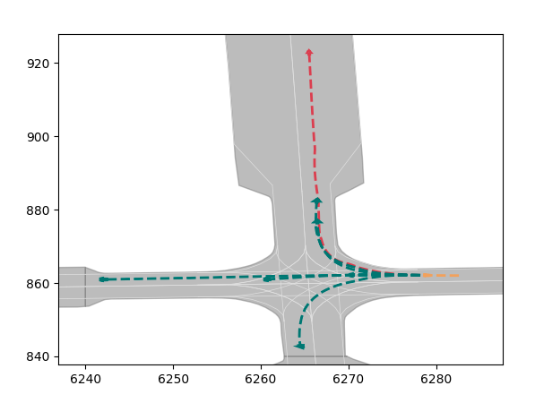
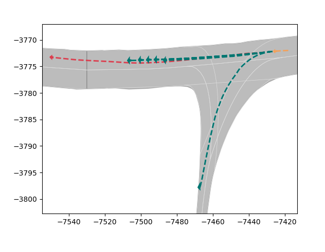

----

一些思考：

1. 如何体现一个模型预测轨迹的能力？是否需要一个仿真环境来部署预测模型，让其一直在仿真环境中开车，持续收集数据？