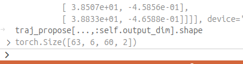
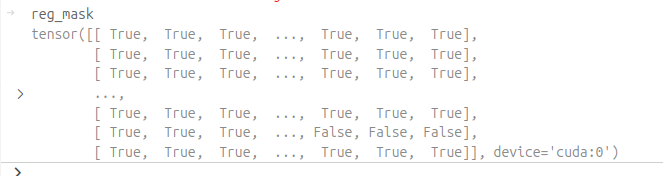
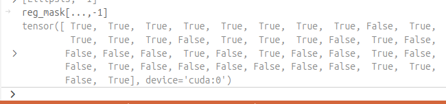
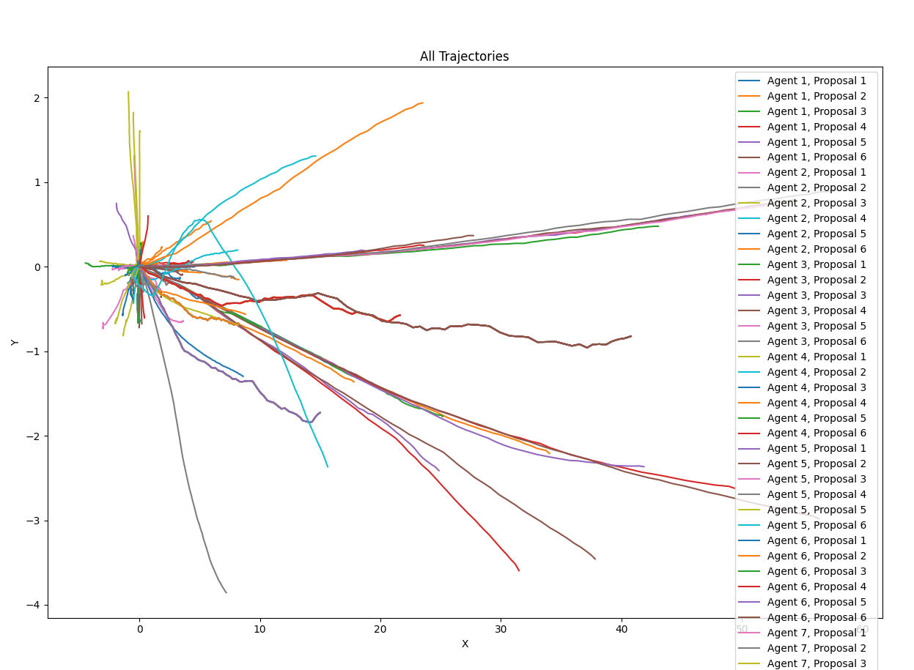
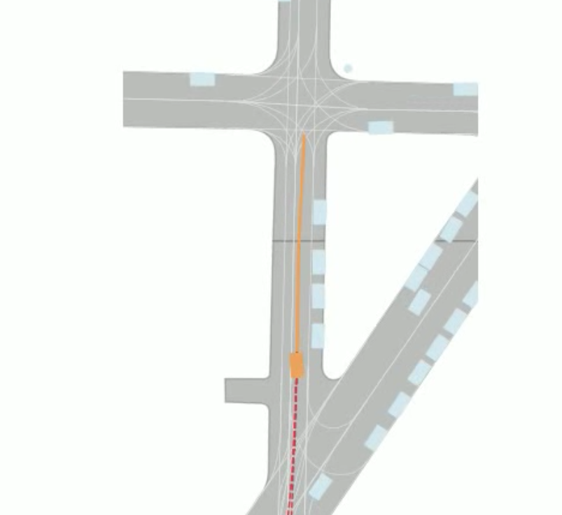

56是目标个数？60是未来预测的timestamps？

经过多轮调试，56这个数值是变化的，可能更接近agent数量。

6可能是6个proposal。

reg_mask是一组bool mask.

需要知道这个regmask是如何生成的。

尝试画了一下预测的proposal trajectorie，但是貌似有两个问题，一个是太多了，一个是好像原点都是00

先解决太多proposal的问题，l2norm后选取best proposals，好了一些，但现在基本确认原点是0,0，这符合论文中相对时空坐标系的描述。

这另一方面说明gt也经过了同样的后处理。通过逆向去写或许能还原回到世界坐标。试试看。

----

在看代码的时候发现test中只使用了traj_refine，但是eval中均使用了traj_proposal和traj_refine，不清楚是何用意。

另外，代码中pi到底是什么感觉不知所云，但是在val的代码中找到了一部分描述：

----

唉又看到有现成的轮子，开摆（大雾）

但是代码还有一些工程问题需要解决。现在就是只有一帧的pred可以拿到。