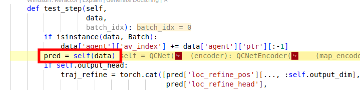
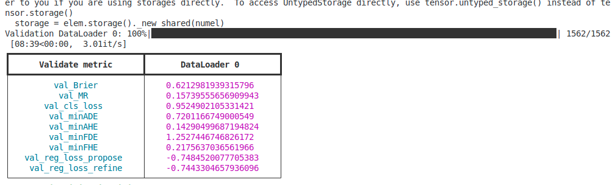
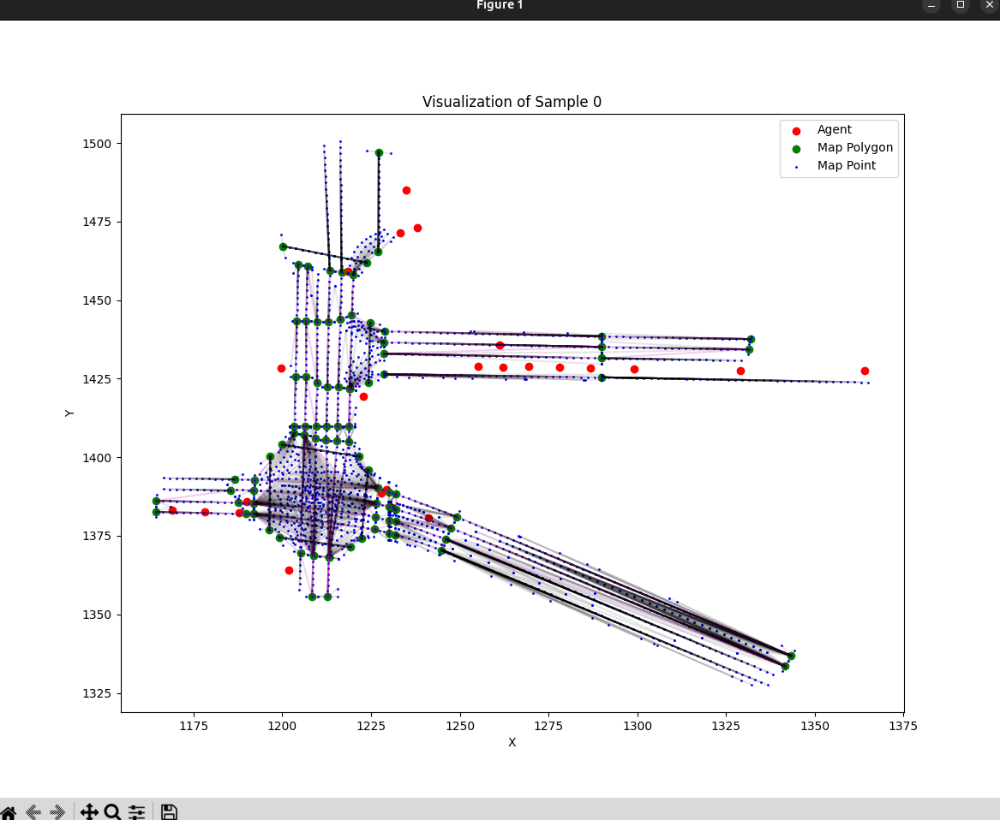

test step核心：模型，输入，输出

在其他一些机器学习或深度学习的项目中，也有类似的概念。例如，在处理多模态数据的任务中，会将图像、文本、音频等不同模态的数据组成一个 “HeteroDataBatch”，然后通过特定的模型架构和处理方法，融合这些不同模态的数据特征，来完成各种任务，如分类、预测等。

validation：



输入：例如：

```javascript
HeteroDataBatch(
  scenario_id=[8],
  city=[8],
  agent={
    num_nodes=314,
    av_index=[8],
    valid_mask=[314, 110],
    predict_mask=[314, 110],
    id=[8],
    type=[314],
    category=[314],
    position=[314, 110, 3],
    heading=[314, 110],
    velocity=[314, 110, 3],
    batch=[314],
    ptr=[9]
  },
  map_polygon={
    num_nodes=639,
    position=[639, 3],
    orientation=[639],
    height=[639],
    type=[639],
    is_intersection=[639],
    batch=[639],
    ptr=[9]
  },
  map_point={
    num_nodes=13445,
    position=[13445, 3],
    orientation=[13445],
    magnitude=[13445],
    height=[13445],
    type=[13445],
    side=[13445],
    batch=[13445],
    ptr=[9]
  },
  (map_point, to, map_polygon)={ edge_index=[2, 13445] },
  (map_polygon, to, map_polygon)={
    edge_index=[2, 1730],
    type=[1730]
  }
)
```

这个数据格式是一个 `HeteroDataBatch` 对象，它是 PyTorch Geometric 中用于处理异质图（heterogeneous graph）数据的批量表示。异质图包含不同类型的节点和边，适用于描述复杂的现实世界场景，如自动驾驶中的多模态数据。下面详细解读这个数据格式的各个部分：

### 整体结构

`HeteroDataBatch` 是一个批量数据对象，它将多个异质图样本组合在一起，方便进行批量处理。每个样本可能代表一个特定的场景，例如自动驾驶中的一个时间步或一个特定的驾驶场景。

### 顶层属性

- **`scenario_id`**: 形状为 `[8]`，这表明该批量数据包含 8 个样本，每个样本有一个唯一的场景 ID，用于标识不同的场景。
- **`city`**: 形状为 `[8]`，同样对应 8 个样本，每个元素表示对应样本所在的城市。

### 节点类型及属性

#### `agent` 节点

- **`num_nodes`**: 该类型节点的总数为 314 个。
- **`av_index`**: 形状为 `[8]`，每个元素表示对应样本中自动驾驶车辆（AV）在 `agent` 节点列表中的索引。
- **`valid_mask`**: 形状为 `[314, 110]`，对于每个 `agent` 节点（314 个），有 110 个时间步的有效性掩码，用于表示该节点在每个时间步是否有效。
- **`predict_mask`**: 形状为 `[314, 110]`，与 `valid_mask` 类似，但用于表示该节点在每个时间步是否需要进行预测。
- **`id`**: 形状为 `[8]`，每个元素可能是对应样本中某个特定 `agent` 的 ID。
- **`type`**: 形状为 `[314]`，表示每个 `agent` 节点的类型，例如车辆、行人等。
- **`category`**: 形状为 `[314]`，表示每个 `agent` 节点的类别，可能是更细粒度的分类。
- **`position`**: 形状为 `[314, 110, 3]`，表示每个 `agent` 节点在 110 个时间步的三维位置。
- **`heading`**: 形状为 `[314, 110]`，表示每个 `agent` 节点在 110 个时间步的朝向。
- **`velocity`**: 形状为 `[314, 110, 3]`，表示每个 `agent` 节点在 110 个时间步的三维速度。
- **`batch`**: 形状为 `[314]`，用于指示每个 `agent` 节点所属的样本编号。
- **`ptr`**: 形状为 `[9]`，用于分割不同样本中的 `agent` 节点，方便进行批量处理。

#### `map_polygon` 节点

- **`num_nodes`**: 该类型节点的总数为 639 个。
- **`position`**: 形状为 `[639, 3]`，表示每个 `map_polygon` 节点的三维位置。
- **`orientation`**: 形状为 `[639]`，表示每个 `map_polygon` 节点的朝向。
- **`height`**: 形状为 `[639]`，表示每个 `map_polygon` 节点的高度。
- **`type`**: 形状为 `[639]`，表示每个 `map_polygon` 节点的类型，例如道路、建筑物等。
- **`is_intersection`**: 形状为 `[639]`，用于指示每个 `map_polygon` 节点是否为交叉路口。
- **`batch`**: 形状为 `[639]`，用于指示每个 `map_polygon` 节点所属的样本编号。
- **`ptr`**: 形状为 `[9]`，用于分割不同样本中的 `map_polygon` 节点。

#### `map_point` 节点

- **`num_nodes`**: 该类型节点的总数为 13445 个。
- **`position`**: 形状为 `[13445, 3]`，表示每个 `map_point` 节点的三维位置。
- **`orientation`**: 形状为 `[13445]`，表示每个 `map_point` 节点的朝向。
- **`magnitude`**: 形状为 `[13445]`，可能表示每个 `map_point` 节点的某种强度或大小。
- **`height`**: 形状为 `[13445]`，表示每个 `map_point` 节点的高度。
- **`type`**: 形状为 `[13445]`，表示每个 `map_point` 节点的类型，例如交通标志点、车道线点等。
- **`side`**: 形状为 `[13445]`，可能表示每个 `map_point` 节点所在的道路侧边。
- **`batch`**: 形状为 `[13445]`，用于指示每个 `map_point` 节点所属的样本编号。
- **`ptr`**: 形状为 `[9]`，用于分割不同样本中的 `map_point` 节点。

### 边类型及属性

#### `(map_point, to, map_polygon)` 边

- **`edge_index`**: 形状为 `[2, 13445]`，表示从 `map_point` 节点到 `map_polygon` 节点的边的索引，第一行是源节点（`map_point`）的索引，第二行是目标节点（`map_polygon`）的索引。

#### `(map_polygon, to, map_polygon)` 边

- **`edge_index`**: 形状为 `[2, 1730]`，表示从 `map_polygon` 节点到 `map_polygon` 节点的边的索引。
- **`type`**: 形状为 `[1730]`，表示每条边的类型，例如连接不同道路段的边、连接交叉路口的边等。

综上所述，这个 `HeteroDataBatch` 对象包含了多个样本的异质图数据，其中包括不同类型的节点（`agent`、`map_polygon`、`map_point`）和边（`(map_point, to, map_polygon)`、`(map_polygon, to, map_polygon)`），以及每个节点和边的相关属性，适用于自动驾驶场景中的多模态数据处理和分析。

直接基于matplotlib编写了可视化代码效果如下：


另外有一个batchsize>1时的问题，就是所有场景会可视化在同一个fig里面，这比较混淆，所以最简单改成单batchsize，后面再考虑效率的问题。

这个是改之前：


这个是改之后（放大了一点），单batchsize并且去除了原点坐标的agent：


现在有另一个问题，就是这个agent点作为散点没有什么意义。agent理论上是一系列的轨迹才对。可视化因此需要进一步的修改。

想要获得轨迹的关键几点：

1. 时间戳
2. track id

