# Reinforcement Learning in Autonomous Driving

the State

the Action

the Policy

> using the policy, given the state, agent will take some actions. and this is the reinforcement learning!

Gen-drive

传统方法：传统的预测性和确定性规划通常将预测和规划过程分开，这会将egovehicle和environment分离开，这种割裂会导致不符合社会驾驶规范的行为。

现有approach的局限性：综合预测规划框架：仍然无法摆脱确定性规划。

进一步瓶颈：行为不确定性，多模态，多目标的相互交互

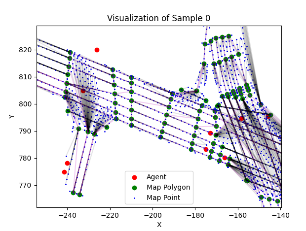

论文创新：to overcome these challenges, we propose the adoption of generation-evaluation methods for the planning task.

关键点：将ego vehicle（agent）整合到一个social interaction context，生成一系列可能得结果，使用一个case evaluator来指导评估决策。

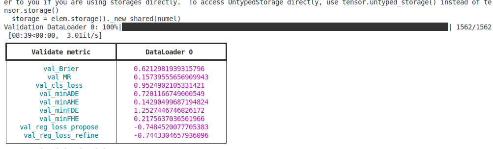

> 这个case evaluator怎么搞

另一个创新点：关于扩散模型：扩散模型当前在决策中的应用仍然有限。主要是两点：

1. 评估哪个case更符合人类价值观和期望是一件很复杂的事情
2. 生成模型用来做规划的数据少，样本少，不像仿真场景。

文章解决这个问题是这样的：引入了一个用来case evaluate的一个评估模型，这是一个vlm base的模型。用于反馈偏好数据进行训练。
另外就是样本少的问题，文章用RL finetuning framework，根据获得的奖励模型来提高扩散生成的质量。用来微调。

> 重点要搞懂两个东西：一个是vlm奖励模型，一个是如何finetune。
> 另外，finetuning的作用是为了更好利用数据？还是为了做数据生成？这是需要明确的。

## gendrive的三大模块

LOOP:
1. 行为扩散模型 - 场景生成器（generate case）
2. 场景评估模型 - VLM based reward model（看case）
3. RL finetuning framework - DDPO算法来优化场景生成器

简述：扩散生成式驾驶策略和训练框架。

一个向量空间中中心查询场景上下文编码器
一个基于扩散场景生成器
一个场景评估其来评估生成的场景质量进行规划

训练过程：
1. 使用大量真实世界的驾驶数据来训练基本的扩散模型（场景编码器+生成器）
2. 生成一个成对的场景偏好数据集，这些场景（case）由扩散模型生成，由VLM混合标注管道来进行打标。
3. 在这个场景偏好数据集的基础上，训练一个场景打分专家。
4. 使用RLAIF来finetune扩散模型，优化生成的轨迹。

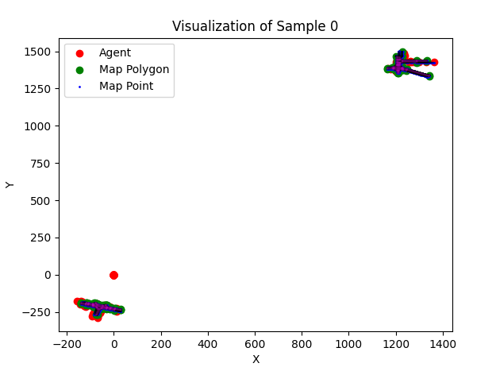

自动驾驶奖励建模reward modeling

奖励建模和场景规划评估是一件有挑战性的任务。

传统评估：人们精心设计指标和功能，例如nuplan评分，预测驾驶模型评分

> 这些指标有一定用处，但是和真是的人类偏好和价值观可能有一些出入，导致使用这些奖励训练的planning model偏离了人类的行为预期。

Inverse Reinforcement Learning（IRL）是一个很有前途的方向！它可以从人类驾驶数据中学习。

逆向强化学习的一个问题是需要对奖励函数结构进行假设，这个假设可能不能反应不同条件下的实际的人类偏好。

最近利用成对人类偏好数据来训练奖励模型越来越受欢迎。这可以进一步去微调生成模型。

> 相关论文已加入queue。

### 自动驾驶生成模型

扩散模型，自回归transformer，用于交通模拟和轨迹预测。

重点：擅长捕获多智能体的联合行为对的复杂和多模态分布，有利于场景生成。

生成交互式行为

扩散模型在多样性和可控性方面有一定的优势。

基于扩散的场景生成中包括ctg++，vbd等等，构成了gendrive的框架基础。

扩散模型在规划中可以参考diffusion es，这是主要用作ego vehicle的轨迹优化方法，不是生成多主体交互的场景，这才是对将来更有意义的事情。

gendrive的目标是通过奖励建模来提高规划的表现，用finetune来改进扩散模型，得到高奖励轨迹，降低采样和计算成本。

### 生成扩散模型的一些目标

用生成扩散模型来取代传统范式中的预测规划模型的关键区别在于，ego vehicle和environment不是割裂的二元，而是不可或缺的组成部分。代理之间的行为彼此交互相互依赖。

因此一个精心准备的数据集是很有意义的。

#### 场景生成扩散模型

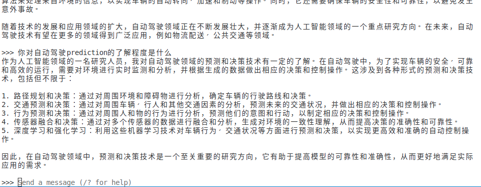

对当前时间步长确定条件下的初始状态驾驶场景。

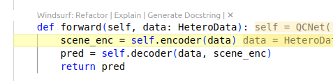

N个object trajectories和M个map
Np：number of waypoints
Do和Dp：每一个点的dimension features
Th：动目标历史轨迹信息

1. 动目标轨迹时间轴上做自注意力transformer
2. 地图进行mlp最大池化
3. concat两个特征形成一个初始编码
4. 使用query centric transformer来进行特征融合来得到一个综合的bev视角下的场景特征编码（场景包括静态场景（地图）和动态场景（动目标交互））（论文应用10，16，21）（sparse object feature）

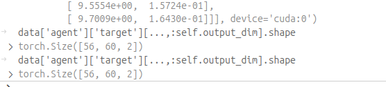

扩散模型

动作（action）的组成：加速度（acceleration）和偏航率（yaw rate）

扩散的范围：在所有感兴趣对象（all objects of interests）Na。

噪声的添加：直接加在动作序列当中：

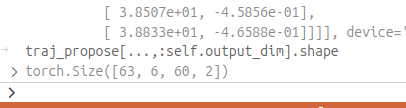

Tf：future timestamp object coordinate

随后的输入到去噪模型：

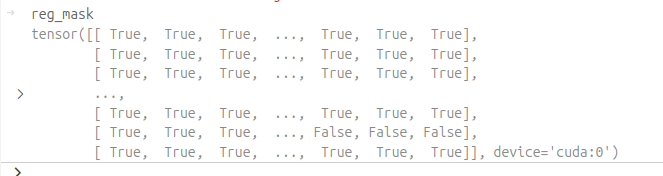

1. 目标未来轨迹：自注意力
2. 目标场景：交叉注意力
3. 采用了额外的交叉注意力层来模拟egoroute（也是要看一下论文10）

生成：未来场景联合目标动作的生成，从搞死噪声开始，K是total的diffusion数，然后每一步diffusion K包括了从transition dynamics中采样。

迭代翻转扩散步骤，得到最终的去噪的联合输出，随后用动力学模型f来推到状态，将对象的动作转换为状态x0=f(a0)，状态包括：x,y坐标，朝向，速度。

### 场景评估

如何进行场景的解算。将扩散生成器的未来场景作为输入，场景可以通过一批高斯噪声并行生成。生成方案结构s∈R^{Sx(Na + M)xD}

另一个场景评估和解算的输入则则是地图信息M。这些未来场景使用查询中心的transformer进行编码得到一个场景特征，并且随后，利用ego agent vehicle的未来的规控轨迹来编码Ae，从编码Se作为场景特征表示来提取。

在transformer解码其中，场景被编码为键和值。transformer中解码器单独处理每个场景的Na+M个元素。

将两个MLP头来加到这个特征张亮上来分别重建规控轨迹和不同生成场景的输出分数。

另外ego planning重建头其实是作为副主任吴来输出，用来提高稳定性和有效性。

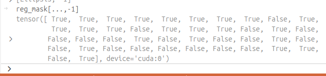

### 再次回顾一下扩散模型

基础的扩散模型进过训练之后，在各种噪声水平和场景条件下，从噪声的联合轨迹输入中，恢复干净的轨迹。

在训练步骤中，对噪声级别和高斯噪声进行采样，来扰动原始动作轨迹。

基础扩散模型的训练损失函数：

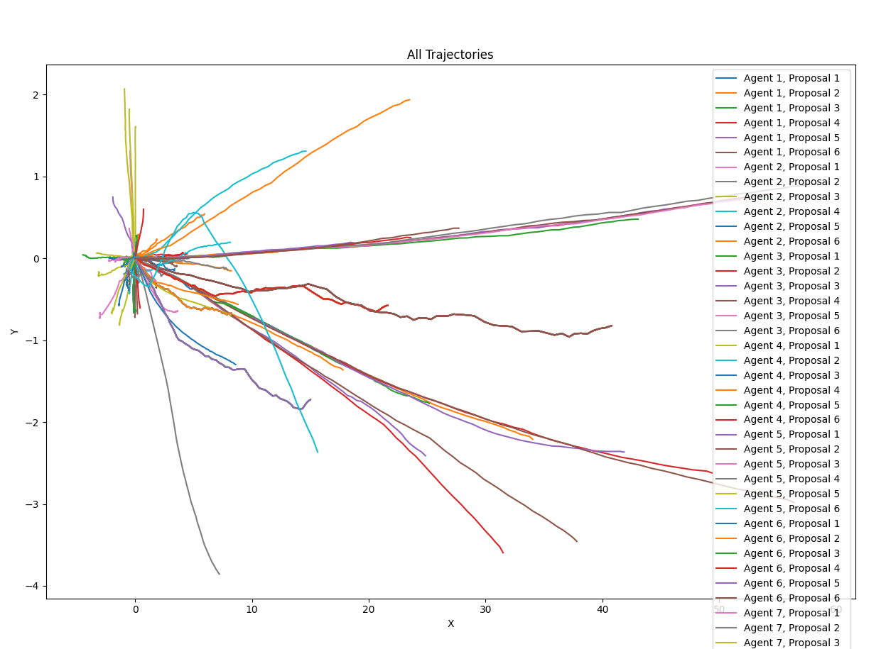

> 当前仍然没有搞懂的东西是文章中所说的动力学模型到底是怎么建构的。自动驾驶更高阶的动力学模型调研。

包括数据集D，smooth l1loss， 动力学模型f，x对象真实未来状态，噪声轨迹ak，场景条件，这是conditions。

## 训练reward model

训练reward model是比较重要的关注的环节。

### pairwise preference data collection

VLM：一个打分专家（结合论文里的描述，这里也可以用豆包来试一试）

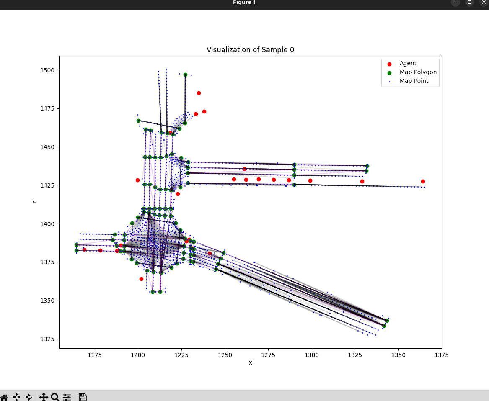

> 让我思考一下，我现在需要分析自动驾驶系统的两个规划方案，A 和 B，判断哪个更优或者是否等效。首先，我得仔细理解用户提供的所有信息。
> 
> 用户提到，图像显示的是自动驾驶汽车前置摄像头支架的当前驾驶场景，但 Bev 视角的图像是两个方案，每个方案的感知范围是 100x100 米。橙色车辆是自车，轨迹用绿色显示，其他对象用蓝色目标框，预测轨迹是橙色。场景地图包括车道中心线（黑色虚线）和可行驶道路（灰色区域）。规划控制轨迹信息每个航点的格式是 (x,y,heading,velocity x,velocity y)，规划范围 5 秒，频率 2Hz，原点在自车当前位置，x 轴是垂直方向，y 轴是水平方向。
> 
> 首先，我需要考虑的是交通规则和人类驾驶行为。比如，是否遵守车道保持，是否有必要变道，如何处理交叉路口，以及如何应对其他车辆和行人的潜在行为。此外，还需要分析两种方案的轨迹是否安全、高效，是否符合常规驾驶习惯。
> 
> 接下来，我需要假设自己看到了这两个 Bev 视角的图像。假设方案 A 和 B 在轨迹上有不同的选择，比如 A 可能保持当前车道，而 B 可能变道超车；或者 A 可能减速让行，而 B 可能继续行驶。但具体情况需要根据图像中的信息来判断。
> 
> 由于用户没有提供具体的图像内容，我需要基于一般情况进行分析。例如，如果自车前方有慢速车辆，方案 A 可能选择变道超车，而方案 B 可能保持原车道。这时候需要考虑是否有足够的空间变道，是否有其他车辆接近，以及是否符合交通法规（如是否在实线区域变道）。
> 
> 另外，预测其他车辆的轨迹也很重要。如果方案 A 的轨迹与其他车辆的预测轨迹有冲突，而方案 B 则避开了冲突点，那么 B 可能更优。同时，还要考虑舒适性，比如是否有急刹车或急加速的情况，这会影响乘客体验。
> 
> 假设在图像中，自车所在车道前方有施工或障碍物，方案 A 可能选择绕行，而方案 B 可能继续直行。这时候需要判断绕行是否必要，是否存在更安全的路径。或者，如果有行人在斑马线上，方案 A 可能更早减速停车，而方案 B 可能较晚反应，这时候 A 更符合交通规则和安全要求。
> 
> 此外，还需要考虑不同文化背景下的驾驶习惯。例如，某些地区可能更倾向于保持车距，而另一些地区可能允许更紧凑的驾驶。但通常自动驾驶系统应遵循普遍认可的安全标准。
> 
> 总结来说，判断哪个方案更好需要综合考虑以下几点：
> 
>     交通规则遵守情况（如车道使用、限速、让行）。
>     与其他车辆、行人的交互安全性（避免碰撞风险）。
>     行驶效率（是否合理利用道路资源，减少不必要的延误）。
>     舒适性（平稳加减速，避免急打方向盘）。
>     符合人类驾驶预期（如提前打转向灯，合理的变道时机）。
> 
> 
> 如果两个方案在所有这些方面都表现相当，那么可能等效。否则，根据具体情况判断哪个更优。
> 
> 例如，假设方案 A 保持在当前车道，而方案 B 试图变道，但此时旁边车道有快速接近的车辆，那么 A 更安全。或者，如果方案 A 在接近路口时减速，而 B 保持速度，可能违反限速，那么 A 更好。
> 
> 但由于没有具体图像，我需要基于一般情况给出可能的结论。例如，如果两个方案都遵守交通规则，且轨迹没有明显冲突，可能等效。如果其中一个方案更主动让行或更高效，则更优。
> 
> 最终，我需要根据上述因素，假设图像中的场景，并做出合理的选择。比如，如果方案 A 在遇到前方车辆时提前减速并保持安全距离，而方案 B 则继续加速，可能 A 更好。或者，如果方案 B 在变道时正确使用转向灯并确认安全，而 A 未变道导致延误，可能 B 更好。
> 
> 由于用户没有提供具体细节，我需要在答案中说明可能的情况，但根据常见场景，可能选择 A 或 B 更好，或者等效。

给出如下的答案：

[A 更好]
在假设场景中，方案 A 的轨迹更符合人类驾驶的预期和安全原则。假设自车前方存在同向行驶的低速车辆，方案 A 选择在安全距离内减速并保持车道，符合交通法规中的跟车要求，同时避免了不必要的变道风险。而方案 B 可能试图变道超车，但如果相邻车道有快速接近的车辆（如蓝色目标框预测轨迹显示冲突），则存在碰撞隐患。此外，方案 A 的航点规划显示更平稳的加减速（如 velocity x/y 变化缓和），提升了舒适性，也减少了对周围车辆的干扰。人类驾驶员通常会优先选择保守但安全的策略，尤其在视线受限或交通参与者行为不确定时，方案 A 的风险规避更符合这一价值观。

输入图像：

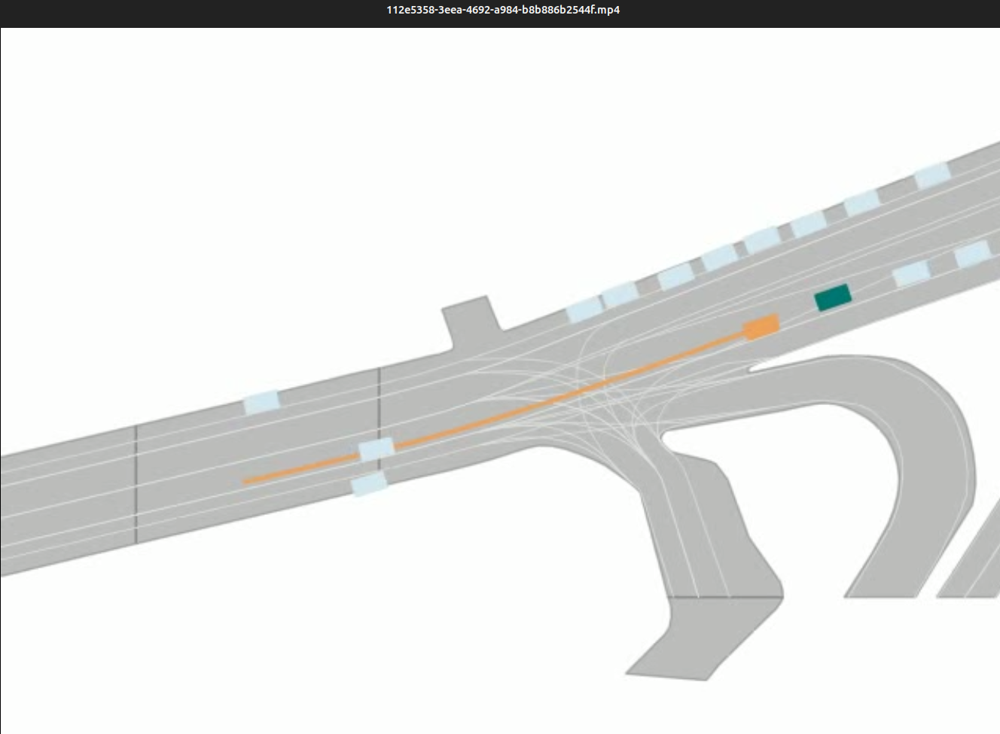

> 输入图像的这一块的格式仍然需要调教一下。

我第一次尝试的答案是这样的：

> 好的，现在需要分析用户提供的图像对应的方案 A 和 B。首先，观察前视相机图像，可能看到路口或道路情况。但用户没给详细 BEV 图内容，只能假设常见场景。比如，假设从 BEV 图看，方案 A 的轨迹是否遵守车道，避让其他车辆。比如，如果 A 保持车道，合理跟车，而 B 可能违规变道或进入不可行驶区域。另外，检查交通规则，比如是否按车道线行驶，对周围车辆的交互是否安全。假设方案 A 的轨迹符合车道中心线，避让其他车辆，而 B 可能有越线或风险。所以判断 A 更好。现在组织语言：
> 
> 首先，因用户未提供 BEV 图详细目标框等信息，基于常规逻辑。假设从常见情况，若方案 A 的轨迹遵循车道（黑色虚线车道中心线），合理处理与周围车辆（蓝色目标框）的交互，比如保持安全距离，按可行驶道路（灰色区域）规划。而方案 B 若存在偏离车道或未合理避让，则 A 更优。结合交通规则，遵守车道线，安全交互是关键。人类驾驶重视安全合规，所以若 A 符合这些，就选 A 更好。现在组织答案：

因未提供 BEV 图像中具体目标框、轨迹冲突等细节，基于常规自动驾驶规划逻辑推理：若从道路场景看，前视图像显示正常道路环境，若方案 A 的轨迹严格沿车道中心线（黑色虚线）规划，在可行驶道路（灰色区域）内合理避让周围车辆（蓝色目标框），遵循交通规则保持安全车距，且轨迹平滑无违规变道或侵入不可行驶区域，则更符合人类驾驶对安全、合规的价值判断。而若方案 B 存在轨迹越线、未合理处理与周围目标交互等问题，A 更优。因此，假设常规场景下，[A 更好]，因其更可能遵循车道规则，安全处理与周围对象的交互，符合交通规则与人类驾驶倡导的安全避让价值观。

### 场景评估器和reward model的区别

在论文中，scene evaluator（场景评估器）和 reward model（奖励模型）紧密相关，在功能上有重合之处，但严格来说不是完全等同的概念。

* 紧密联系：论文提到利用成对偏好数据训练场景评估器，其训练方式与奖励模型一致，从这个角度场景评估器可以被看作是奖励模型 。
* 在 Gen - Drive 框架中，两者都用于评估生成的场景（计划），且场景评估器（奖励模型）通过对生成场景打分，为决策提供依据，帮助选择最优场景，引导自动驾驶决策，提升规划性能。
* 细微差别：从概念上看，场景评估器更侧重对场景的全面评估，判断场景的合理性、安全性等；而奖励模型则更强调为场景分配一个量化的奖励值，用于强化学习中的策略优化。
* 在实际应用中，场景评估器在筛选生成的场景时，会综合考虑多种因素进行评估；奖励模型则直接为场景打分，这个分数在强化学习微调扩散模型时作为优化的依据，以提升模型生成高奖励场景的能力 。

在每个训练步骤中，抽取一批成对的比较结果。接受正样本case和拒绝负样本case Sa和Sr 在given相同初始条件下。

损失函数：

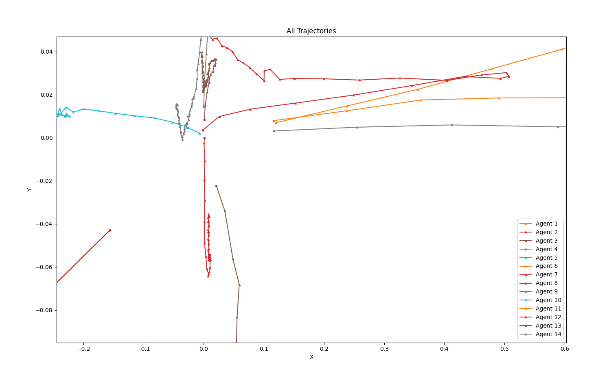

R代表输出的预测分数。

### 使用RL finetuning生成模型

目的是提高规控任务的扩散生成有效性。

### DDPO

Denoising diffusion policy optimization 去噪扩散轨迹优化（DDPO）

流程：finetuning of generation with ddpo：

输入条件：预训练的生成模型，已经训练好的奖励模型，采样迭代次数，学习率，微调部署，更新规则等。

初始化：预训练生成模型

循环：从t=1到T时刻执行

1. 从当前扩散模型中生成m个样本
2. 收集m个样本的奖励分数
3. 对i=1到m，归一化奖励值（减均值除方差）
4. 计算完整的损失函数，求和取平均
5. 更新规则来更新预训练load的参数值

循环结束后输出finetune的生成模型
