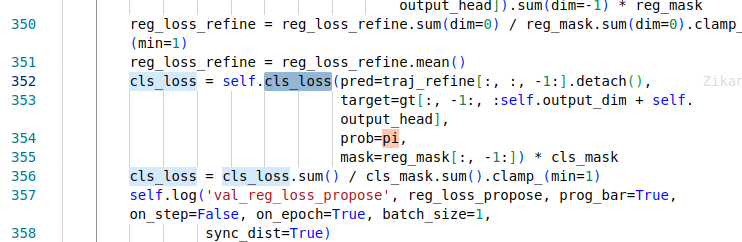
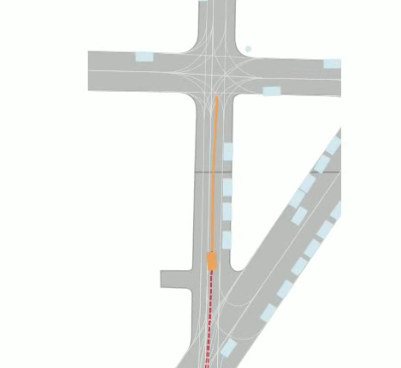

# nuplan devkit install notes

总算是跑出可视化了，记录一下安装过程中出现的问题：

## nuplan pip install -r requirements.txt

1. python 版本选择3.9
2. pip需要downgrade到24.0
3. opencv python安装4.4.0.46比较顺利
4. 需要更新cmake，以及安装opencv python需要前置依赖：sudo apt-get install cmake git libgtk2.0-dev pkg-config libavcodec-dev libavformat-dev libswscale-dev
5. numpy==1.23.4
6. gcc-9
7. g++-9

## 后续需要做的事情

1. 准备模型训练和最基本的数据准备
2. benchmark调研

关于场景

场景交互的模拟是在感知抽象之上的。去除传感器，可以直接基于地图信息 - 动目标条件，来构造抽象的交互场景。

在感知到规控不是端到端的条件下，这意味着对感知进行完美假设，也就是我们常说的完美感知。
