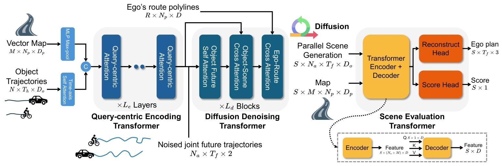

# 2025.4.7

## paper reading

### Gen-Drive: Enhancing Diffusion Generative Driving Policies with Reward Modeling and Reinforcement Learning Fine-tuning

- *南洋理工、Nvidia和斯坦福*

1. **传统planning的局限**
    - 预测与规划过程分开，导致车辆与环境分离，产生不符合社会驾驶规范行为。
    - 当前确定性规划存在行为不确定性、多模态、多目标相互交互等瓶颈。
    - 论文认为generation - evaluation的范式更为先进。
    - 
    - 
2. **扩散模型的局限**
    - 评估符合人类价值观和期望复杂，以及用于规划的数据和样本少。
    - 论文的方式：VLM evaluator + RL finetuning diffusion model
    - 
3. **Gen - drive的三大模块**
    - **行为扩散模型**：作为场景生成器generate case。
    - **场景评估模型**：基于VLM的reward model用于看case。
    - **RL finetuning framework**：采用DDPO算法优化场景生成器。
    - 
4. **reward modeling**
    - 传统评估指标与人类偏好和价值观有出入，导致规划模型偏离人类行为预期。
    - 文章认为Inverse Reinforcement Learning（IRL）因为模型结构假设，可能不符合实际的人类偏好。
    - 文章指出利用人类偏好数据对训练奖励模型很受欢迎。
    - **pairwise preference data collection**：介绍利用VLM收集成对偏好数据，分析不同规划方案优劣。
    - **场景评估器和reward model的区别**：
      - 其实两者还是联系比较紧密的，但是目的不太一样
      - evaluator侧重在全面评估场景，而reward model强调为场景分配奖励值，后续用于强化学习策略优化。
      - 这里后续可以再了解一些生成对抗式强化学习的内容，*Generative Adversarial Imitation Learning，GAIL*。
      - 
5. **使用RL finetuning生成模型**
    
      - 介绍使用DDPO提高规控任务扩散生成有效性的流程，包括输入条件、初始化、循环步骤及最终输出。
      - DDPO简介：Black 等人（2024年）和 Fan 等人（2023年）**将条件扩散概率模型的训练和微调形式化为一个马尔可夫决策过程（MDP）**。Black 等人（2024年）定义了一类算法，称为去噪扩散策略优化（DDPO），该算法优化任意奖励函数，以改进使用 RL 对扩散模型进行引导微调。
      - https://zhuanlan.zhihu.com/p/662964699

### QCNet: Query-Centric Trajectory Prediction

- 这篇是gendrive中所使用的预测模型主干，具体的细节我还在阅读。
  - **解决的问题**：提高多种异构场景处理效率，解决预测不确定性及多种可能性权衡问题。
  - **输入和输出形式**：
    - 输入：运动目标状态，高清地图
    - 输出：为每个目标预测的未来轨迹及概率得分。
  - **以查询为中心的场景上下文编码**：建立局部时空坐标系，将几何属性转换为傅里叶特征，结合语义属性，经MLP得到嵌入，计算相对时空位置embedding，对map和agent采用自注意力和因式分解注意力，降低推理复杂度。
  - **基于查询的轨迹解码**：生成自适应轨迹锚，再由基于锚的模块优化，两个类似DETR的架构，通过特定注意力机制更新query。

### 关于数据集

简单调研了一些主流的数据集：

1. **Argoverse**：由Argo AI发布，城市道路场景下人类驾驶员的行为预测数据集。超过30万个带标注的真实世界轨迹，包括高精度地图信息。
2. **Waymo Open Dataset**：多个城市，不同天气条件。包含激光雷达、摄像头图像，丰富的动态要素移动模式。
3. **NuPlan**：多模态感知融合及复杂环境下动作。有激光雷达，摄像头图像，毫米波雷达，语义分割标签。
4. **Bosch Road Anomaly Detection Dataset (ROAD)**：博世针对异常事件识别而构建的小型数据集。在特定应用场景如紧急避障方面有特色。
5. **CARLA NoCrash Benchmark**：衡量不同方案应对突发状况的能力，内容包括静态障碍物绕行，行人突然闯入等随机因素等。场景可以仿真复现。
6. **DAIR - V2X**：百度Apollo、北京智源人工智能研究院。

## coding

*因为现在权限还不全，所以目前只用自己的机器做了些简单的事情。*

1. 下载了nuplan数据集的一个mini子集（map，split，无sensor data），调通了nuplan-devkit，并做了一些可视化，目前还在探索这个数据集使用的一些细节。

> 其实目前只有地图和动目标信息，不用sensor信息是足够的。
> 下个阶段再看需要打通感知主干（动目标感知，静态道路元素等）。

2. 正在调试QCNet: Query-Centric Trajectory Prediction这篇工作的代码，目前还有一些工程上的小问题。
3. 了解了一些这边提交集群任务的流程：http://10.15.89.177:8889/

## Todos

1. 继续调研reward modeling paper reading，以及一些其他工作。
2. 完成qcnet的部署。
3. 调研argoverse的数据集用法。
4. 对DDPO的算法设计和执行细节，后续想再深入去看一下。
5. 当前是否有llm的api？或者是否有本地部署？在这个基础上，看是否能够搭建一个智驾偏好数据对的生成通路。
